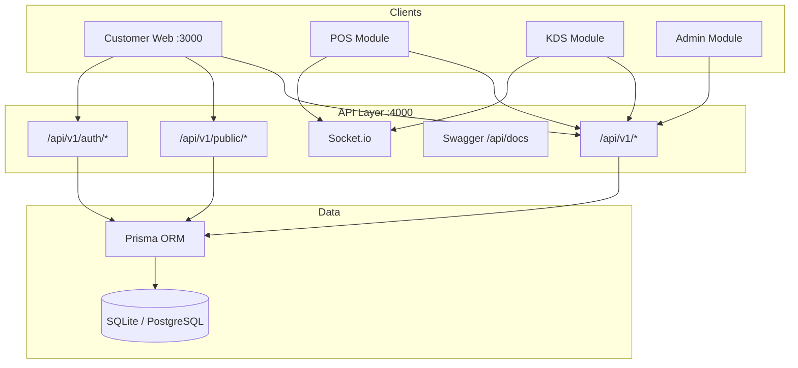

# Nexovo Cafe System

**Enterprise restaurant & cafe management ecosystem** — unified customer ordering, POS, kitchen display (KDS), admin dashboard, inventory, CRM, loyalty, GST billing, and multi-branch readiness. Built for the Indian market with **INR pricing** and GST-compliant invoicing.

[](https://nodejs.org/)
[](https://www.typescriptlang.org/)
[](https://nextjs.org/)
[](https://www.prisma.io/)
[](LICENSE)

---

## Overview

Nexovo Cafe System is a **monorepo platform** that powers the full lifecycle of a modern cafe or restaurant chain:

| Surface | Description |
|---------|-------------|
| **Customer Web** | Browse menu, cart, checkout (Delivery / Pickup / Dine-in), coupons, order tracking |
| **POS** | Cashier billing, table management, split bills |
| **KDS** | Kitchen ticket queue, prep status, order flow |
| **Admin** | Dashboard, analytics, menu & branch management |
| **Super Admin** | Multi-branch governance, tenant controls |
| **API** | Versioned REST, JWT auth, RBAC, Swagger, Socket.io realtime |

All roles run from a **single unified web app** at `http://localhost:3000` with an in-app role switcher.

---

## Screenshots & Demo

| Service | URL |
|---------|-----|
| **Nexovo Cafe System** (Customer, POS, KDS, Admin, Super Admin) | http://localhost:3000 |
| Admin redirect | http://localhost:3001 → `:3000` |
| API + Swagger | http://localhost:4000/api/docs |

### Demo credentials

| Role | Email | Password |
|------|-------|----------|
| Owner / Admin | `owner@nexovo.demo` | `Demo@123` |
| Customer | `customer@nexovo.demo` | `Demo@123` |

**Demo coupon:** `CHAMPION25` (25% off) · **Order prefix:** `NX-` · **Currency:** ₹ INR

---

## Quick Start

### Prerequisites

- **Node.js** ≥ 20.11
- **npm** ≥ 10

### 1. Clone & install

```bash
git clone https://github.com/aadityapa/Nexovo-Cafe-System.git
cd Nexovo-Cafe-System
npm install
```

### 2. Configure environment

```bash
cp apps/api/.env.example apps/api/.env
```

Default demo uses **SQLite** (`DATABASE_URL=file:./dev.db`). No PostgreSQL required for local demo.

Customer web expects:

```env
# apps/customer-web/.env.local
NEXT_PUBLIC_API_URL=http://localhost:4000
```

### 3. Initialize database

```bash
npm run prisma:push -w @cafe/api
npm run prisma:seed
```

### 4. Run everything

```bash
npm run dev:all
```

Or run services individually:

```bash
npm run dev:api       # API on :4000
npm run dev:customer  # Customer web on :3000
npm run dev:admin     # Admin redirect on :3001
```

---

## Technology Stack

| Layer | Technology |
|-------|------------|
| Frontend | Next.js 15, React 19, TypeScript, Tailwind CSS |
| Backend | Node.js, Express, TypeScript |
| ORM / DB | Prisma — SQLite (demo) / PostgreSQL (production) |
| Auth | JWT access + refresh tokens, RBAC |
| Realtime | Socket.io (orders & kitchen channels) |
| API docs | OpenAPI / Swagger UI |
| CI/CD | GitHub Actions |
| Deploy | Docker, AWS ECS, Vercel (baseline) |

---

## Monorepo Structure

```
Nexovo-Cafe-System/
├── apps/
│   ├── api/              # Express REST API, Prisma, auth, Socket.io
│   ├── customer-web/     # Unified Nexovo platform (Customer, POS, KDS, Admin)
│   ├── admin-web/        # Redirects to customer-web unified platform
│   └── mobile/           # Expo placeholder (future)
├── packages/
│   ├── contracts/        # Shared roles, permissions, API contracts
│   └── ui/               # Shared design-system components
├── docs/
│   ├── architecture/     # System design, phases, diagrams
│   ├── database/         # ERD and entity mapping
│   └── deployment/       # Local and production deployment
├── infra/                # Docker, CI workflows
└── package.json          # npm workspaces root
```

---

## Architecture

High-level request flow:



### Key API routes

| Method | Route | Purpose |
|--------|-------|---------|
| GET | `/api/v1/public/bootstrap` | Restaurant, menu, branches |
| GET/POST | `/api/v1/public/orders` | List & create orders |
| PATCH | `/api/v1/public/orders/:id/status` | KDS / POS status updates |
| GET | `/api/v1/public/analytics` | Dashboard metrics |
| POST | `/api/v1/auth/login` | JWT authentication |

Full documentation:

- [System Architecture](docs/architecture/system-architecture.md)
- [Architecture Overview & Diagrams](docs/architecture/overview.md)
- [Data Flow](docs/architecture/data-flow.md)
- [18-Phase Roadmap](docs/architecture/implementation-phases.md)
- [ERD Mapping](docs/database/erd-mapping.md)
- [Deployment Guide](docs/deployment/deployment-notes.md)
- [Documentation Index](docs/README.md)

### Interactive architecture canvas

Open the live architecture canvas beside the chat in Cursor IDE:

[`nexovo-cafe-architecture.canvas.tsx`](C:/Users/Admin/.cursor/projects/d-Cafe/canvases/nexovo-cafe-architecture.canvas.tsx)

---

## Features (Current Demo)

- Menu browse with categories, modifiers, and INR pricing
- Cart, checkout (Delivery / Pickup / Dine-in), coupon discounts
- Order lifecycle: Placed → Confirmed → Preparing → Ready → Completed
- POS billing and table assignment
- KDS ticket queue with status advancement
- Admin analytics dashboard
- Super Admin multi-branch view
- AI chat widget (local fallback responses)
- Graceful offline fallback when API is unavailable

---

## Database

Enterprise Prisma schema covering:

- **Identity:** users, roles, permissions, refresh tokens, audit logs
- **Tenant:** restaurants, branches, staff profiles
- **Catalog:** categories, menu items, modifiers
- **Orders:** orders, items, kitchen tickets, payments, invoices, GST breakup
- **Operations:** inventory, stock movements, loyalty, notifications
- **Channels:** WhatsApp, AI voice, kiosk (schema-ready)

Demo data is seeded via `npm run prisma:seed` into `apps/api/prisma/dev.db`.

For production, switch `provider` to `postgresql` in `schema.prisma` and set `DATABASE_URL`.

---

## Scripts

| Command | Description |
|---------|-------------|
| `npm run dev:all` | Start API + customer + admin |
| `npm run dev:api` | API only |
| `npm run dev:customer` | Customer web only |
| `npm run prisma:seed` | Seed demo data |
| `npm run prisma:push` | Push schema to DB |
| `npm run lint` | Lint contracts + API |
| `npm run test` | Run API tests |
| `npm run build` | Build contracts + API |

---

## Production Deployment

See [docs/deployment/deployment-notes.md](docs/deployment/deployment-notes.md).

Recommended stack:

- **API:** AWS ECS/Fargate or Docker + Nginx
- **Web:** Vercel (customer + admin)
- **Database:** AWS RDS PostgreSQL
- **Cache:** Redis (ElastiCache)
- **Media:** Cloudinary
- **Secrets:** AWS Secrets Manager / environment variables

---

## Roadmap

The platform follows an **18-phase delivery plan**. Phase 1 (foundation) is complete. Next priorities:

1. Menu authoring workflows with media pipeline
2. Full order orchestration across customer, POS, and KDS
3. Payment gateway integration (Razorpay / UPI)
4. Inventory consumption from order fulfillment
5. Branch-level access scopes

See [implementation-phases.md](docs/architecture/implementation-phases.md) for the full roadmap.

---

## Contributing

1. Fork the repository
2. Create a feature branch: `git checkout -b feature/my-feature`
3. Commit changes: `git commit -m "Add my feature"`
4. Push: `git push origin feature/my-feature`
5. Open a Pull Request

---

## License

MIT License — see [LICENSE](LICENSE) for details.

---

## Author

**Aaditya PA** — [GitHub](https://github.com/aadityapa)

Repository: [https://github.com/aadityapa/Nexovo-Cafe-System](https://github.com/aadityapa/Nexovo-Cafe-System)
