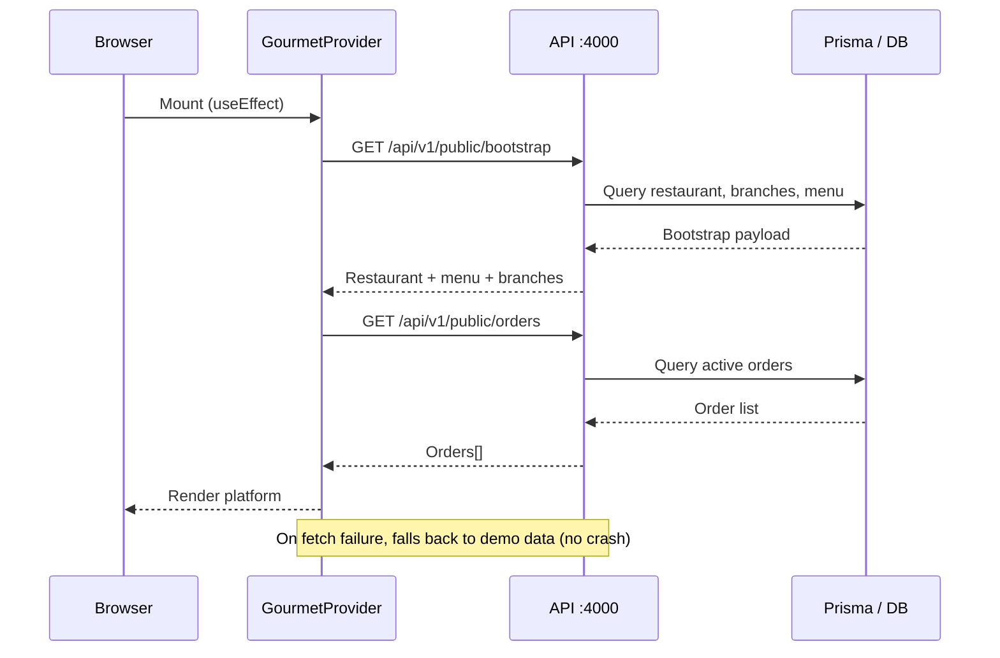
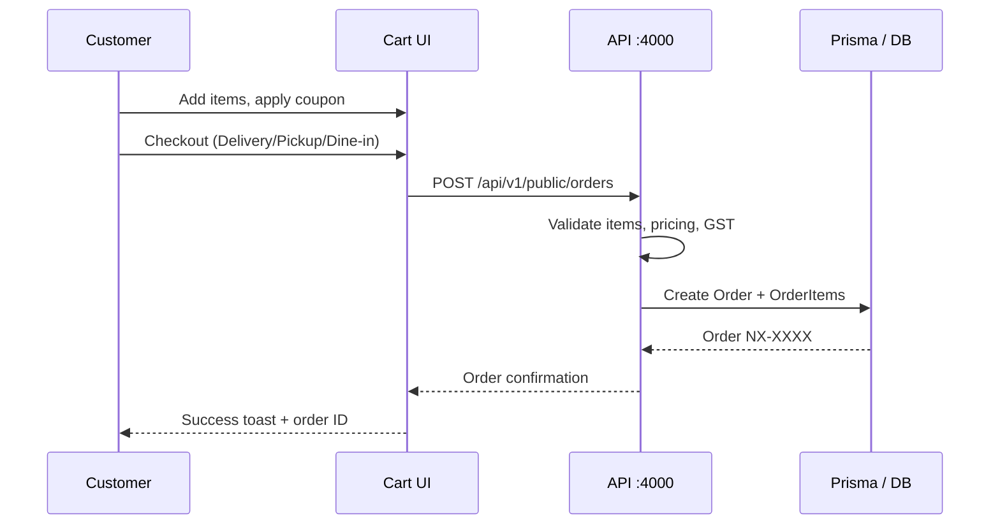
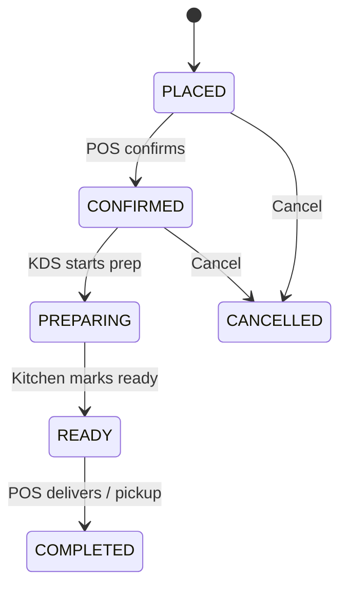
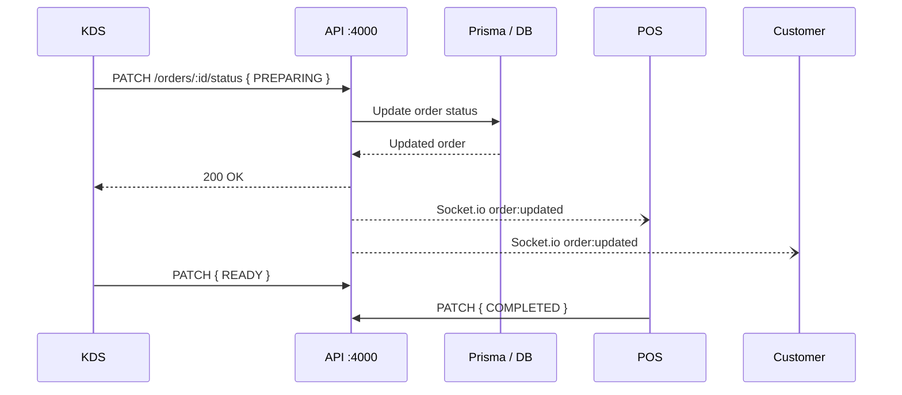
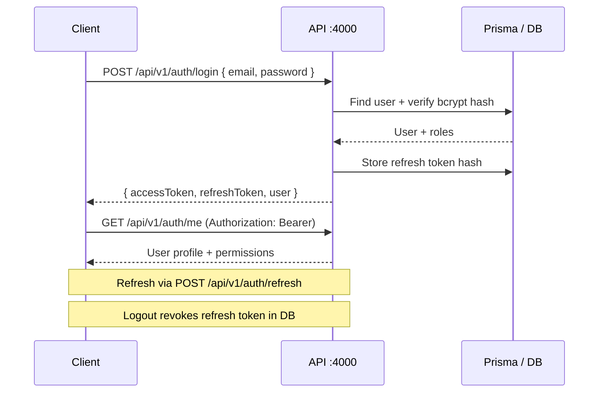
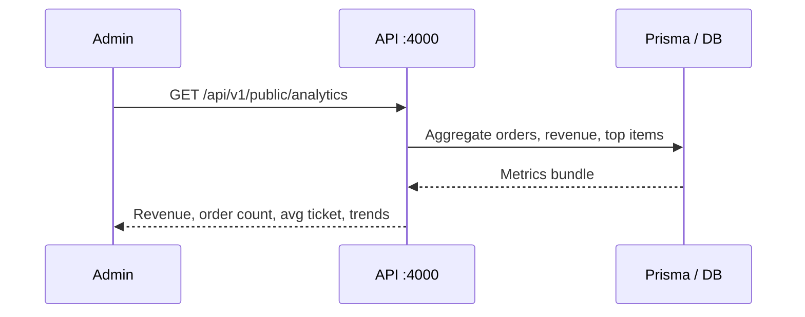

# Data Flow — Nexovo Cafe System

Sequence diagrams and event flows for core platform operations.

## 1. Application Bootstrap

When the customer web app loads, `GourmetProvider` fetches bootstrap data and orders from the API.

## 2. Customer Order Placement

## 3. Order Status Lifecycle

Orders progress through a defined state machine shared across POS, KDS, and customer views.

## 4. Authentication Flow

## 5. Realtime Events (Socket.io)

| Namespace | Event | Payload | Consumers |
|-----------|-------|---------|-----------|
| `/orders` | `order:created` | Order object | KDS, Admin |
| `/orders` | `order:updated` | Order + status | POS, KDS, Customer |
| `/kitchen` | `ticket:ready` | Ticket ID | POS, Customer |

Scaffolding lives in `apps/api/src/realtime/`. Demo mode uses REST polling with graceful Socket.io upgrade path.

## 6. Analytics Dashboard

## 7. Offline Resilience

The customer web client implements safe fetch wrappers:

1. `fetchBootstrap()` — returns demo menu if API unreachable
2. `fetchOrders()` — returns `[]` on network failure
3. `GourmetProvider` — catches errors, shows toast, continues with local state

This prevents the "Failed to fetch" runtime crash when the API is not running.

## Related Documents

- [Architecture Overview](./overview.md)
- [System Architecture](./system-architecture.md)
- [ERD Mapping](../database/erd-mapping.md)
