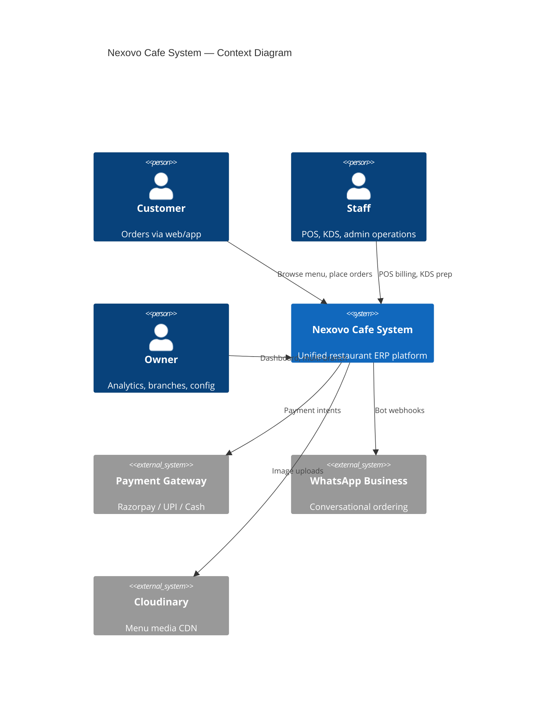
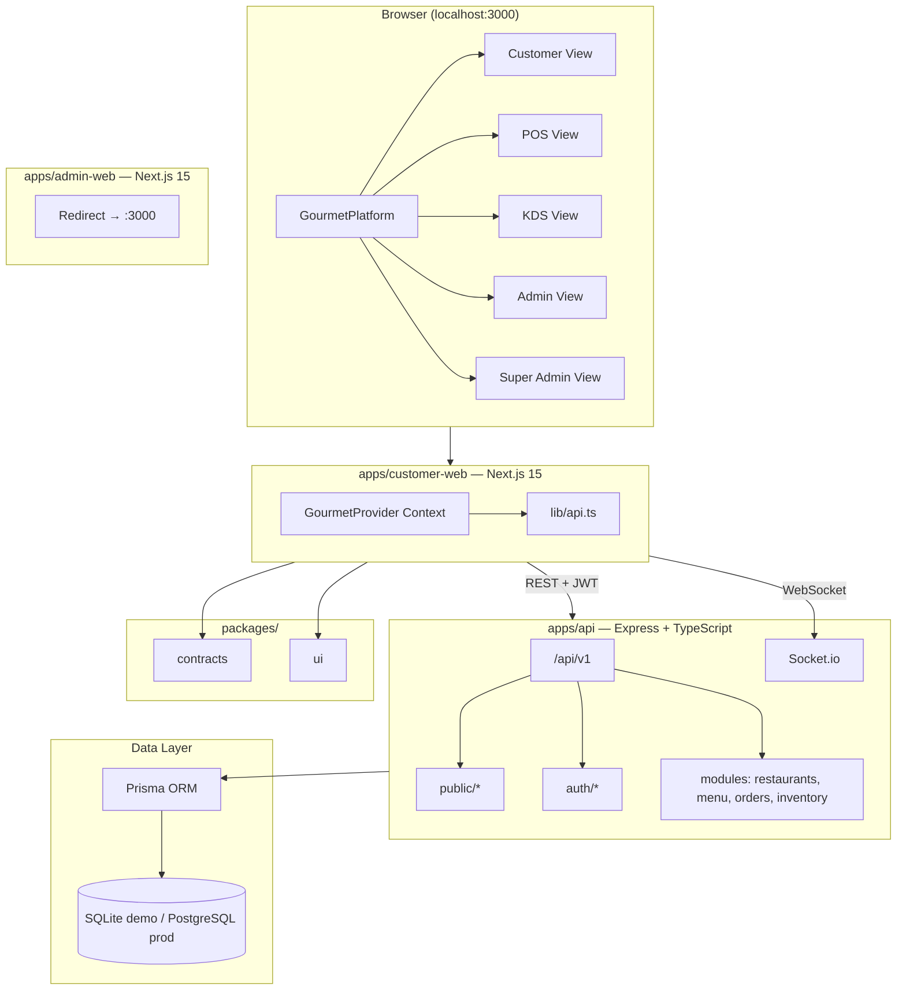
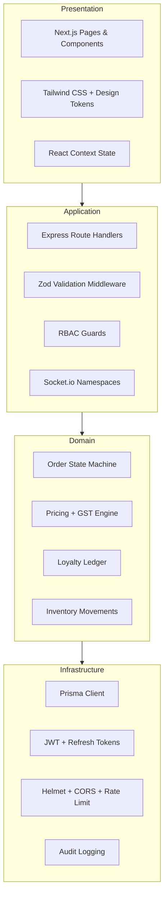
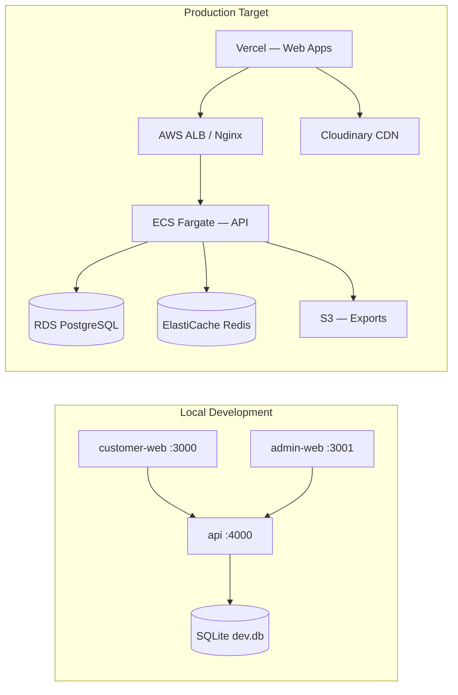
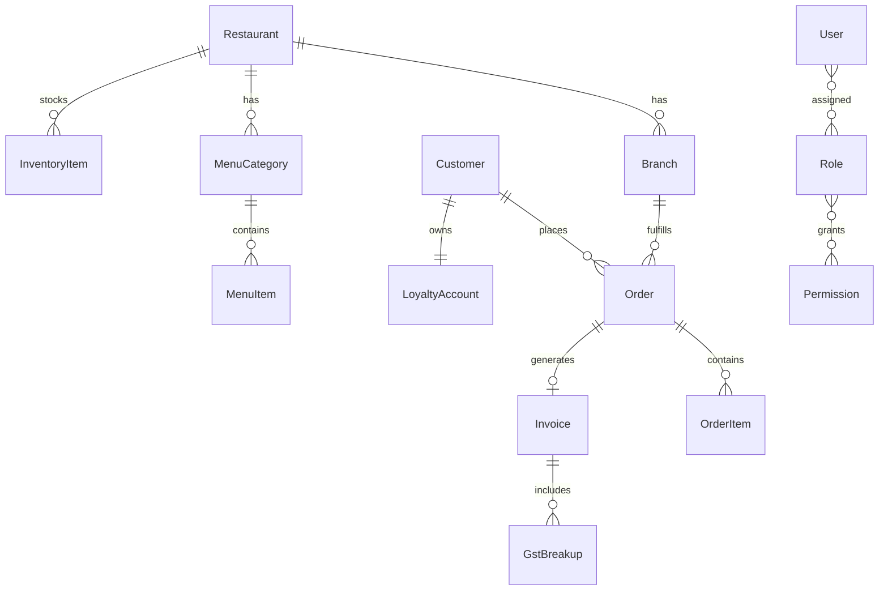

# Nexovo Cafe System — Architecture Overview

This document provides visual architecture diagrams and a component map for the Nexovo Cafe System monorepo.

## 1. System Context

## 2. Container Diagram

## 3. Module Map

| Module | Location | Status |
|--------|----------|--------|
| Customer ordering | `apps/customer-web/components/gourmet/` | Demo complete |
| POS billing | `apps/customer-web/components/gourmet/pos-view.tsx` | Demo complete |
| Kitchen KDS | `apps/customer-web/components/gourmet/kds-view.tsx` | Demo complete |
| Admin dashboard | `apps/customer-web/components/gourmet/admin-view.tsx` | Demo complete |
| Super Admin | `apps/customer-web/components/gourmet/super-admin-view.tsx` | Demo complete |
| Public API | `apps/api/src/api/v1/modules/demo/` | Demo complete |
| Auth + RBAC | `apps/api/src/modules/auth/` | Baseline |
| Restaurants / Menu | `apps/api/src/api/v1/modules/` | Scaffold |
| Orders / Inventory | `apps/api/src/api/v1/modules/` | Scaffold |
| Realtime | `apps/api/src/realtime/` | Scaffold |
| Mobile app | `apps/mobile/` | Placeholder |

## 4. Layered Architecture

## 5. Deployment Topology

## 6. Security Model

| Control | Implementation |
|---------|----------------|
| Authentication | JWT access (short TTL) + refresh token with DB revocation |
| Authorization | Role-based access control via `@cafe/contracts` permissions |
| Input validation | Zod schemas on all mutating endpoints |
| Transport | Helmet headers, strict CORS allowlist |
| Rate limiting | Auth route throttling |
| Audit | Composable audit log model on operational entities |
| Tax compliance | GST breakup schema for Indian invoicing |

## 7. Data Domains

See [erd-mapping.md](../database/erd-mapping.md) for full entity mapping.

## 8. Related Documents

- [System Architecture](./system-architecture.md)
- [Data Flow](./data-flow.md)
- [Implementation Phases](./implementation-phases.md)
- [Deployment Notes](../deployment/deployment-notes.md)
